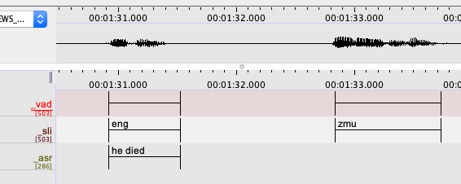

# VAD-SLI-ASR

Python scripts for a speech processing pipeline with Voice Activity Detection (VAD), Spoken Language Identification (SLI), and Automatic Speech Recognition (ASR). Our use case involves using VAD to detect time regions in a language documentation recording where someone is speaking, then using SLI to classify each region as either English (eng) or Muruwari (zmu), and then using an English ASR model to transcribe regions detected as English. This pipeline outputs an ELAN .eaf file with the following tier structure (`_vad`, `_sli`, and `_asr`):

<p align="center">
    
</p>

## Set up

### Environment

1. Clone this repository and change into directory:
    ```bash
    git clone https://github.com/CoEDL/vad-sli-asr.git
    cd vad-sli-asr
    ```
3. Launch Docker image (recommended):

   a. CPU (use this if you are not sure about the GPU option)
      ```bash
      docker-compose run --rm cpu
      ```
    b. GPU pass-through (tested using CUDA 11.3, cuDNN 8200, and Docker 20.10.7 on host machine) 
      ```
      docker-compose run --rm gpu
      ```
   c. Manual setup. See the commands and commentary in the `Dockerfile` for step-by-step setup guide.

### Data

We do not have permissions to release the Muruwari audio and transcriptions used in the paper. For illustrative purposes, we have included a `toy-example` in the `data` folder of me (Nay San) saying some words alternating in French and English:

```
├── data
│   ├── toy-example
│   │   ├── raw/               <- Deployment data, to be passed through vad-sli-asr pipeline
│   │   │   │   ├── hello-goodbye.wav
│   │   ├── clips/             <- Training data (for SLI; one folder per language)
│   │   │   ├── eng/           <- .wav files (English utterances)
│   │   │   │   ├── eng-01.wav <- hello
│   │   │   │   ├── eng-02.wav <- goodbye
│   │   │   ├── fra/           <- .wav files (French utterances)
│   │   │   │   ├── fra-01.wav <- bonjour
│   │   │   │   ├── fra-02.wav <- au revoir
│   │   ├── eng-sentences.tsv  <- transcriptions of English clips for ASR training
│   │   ├── eng-texts.txt      <- text file of (unrelated) English sentences for language model training (optional)
```

## Usage

### VAD

#### Deployment

Detect speech regions in `data/toy-example/hello-goodbye.wav` and (by default) write detected regions as annotations on `_vad` tier in a side-car ELAN file (default) `data/toy-example/hello-goodbye.eaf`

```bash
python scripts/run_vad-by-silero.py data/toy-example/hello-goodbye.wav
```

<p align="center">
    
</p>

### SLI

#### Training

Use utterances supplied in `data/toy-example/clips` and train a logistic regression classifier with SpeechBrain embeddings as features and folder names (e.g. `eng`, `fra`) as training labels for the utterances, and save trained classifier to `data/toy-example/eng-fra_classifier.pkl`.

```
python scripts/train_sli-by-sblr.py data/toy-example/clips data/toy-example/eng-fra_classifier.pkl
```

#### Deployment

Use trained classifier located at `data/toy-example/eng-fra_classifier.pkl` to classify regions speech regions associated with `data/toy-example/hello-goodbye.wav` located on the `_vad` tier of `data/toy-example/hello-goodbye.eaf` and write the classified regions onto the `_sli` tier:

```bash
python scripts/run_sli-by-sblr.py data/toy-example/eng-fra_classifier.pkl data/toy-example/hello-goodbye.wav
```

<p align="center">
    
</p>

### ASR

#### Deployment (off-the-shelf model)

Use the pre-trained `facebook/wav2vec2-large-robust-ft-swbd-300h` on [HuggingFace Hub](https://huggingface.co/facebook/wav2vec2-large-robust-ft-swbd-300h) to transcribe regions of interest of the audio file `data/toy-example/hello-goodbye.wav` (by default, regions of interest (ROI) are defined as those on the `_sli` tier matching the regular expression `eng`; note the optional `--roi_tier` and `--roi_regex` arguments):

```bash
python scripts/run_asr-by-w2v2.py \
    facebook/wav2vec2-large-robust-ft-swbd-300h \
    data/toy-example/hello-goodbye.wav \
    --roi_tier _sli \
    --roi_regex eng
```

<p align="center">
    
</p>

#### Training (fine-tuning an off-the-shelf model)

**Note. These commands will not work well (or at all) with the toy example given how small the dataset is**. Provided for usage illustration only.

##### Without a language model

```bash
# Fine-tune a pre-trained wav2vec 2.0 model without a language model
python scripts/train_asr-by-w2v2-ft.py \
    facebook/wav2vec2-large-robust-ft-swbd-300h \   # Starting checkpoint
    data/toy-example/my-fine-tuned-model \          # Output directory
    data/toy-example/eng-sentences.tsv \            # TSV file for training data
    data/toy-example/eng-sentences.tsv              # TSV file for evaluation data (using same data twice for illustration only!)
```

##### With a language model

```bash
# Build a 2-gram language model built using KenLM
lmplz -o 2 < tmp/toy-example/eng-texts.txt > data/toy-example/eng-2gram.arpa

# Fine-tune a pre-trained wav2vec 2.0 model with a 2-gram language model
python scripts/train_asr-by-w2v2-ft.py \
    facebook/wav2vec2-large-robust-ft-swbd-300h \   # Starting checkpoint
    data/toy-example/my-fine-tuned-model \          # Output directory
    data/toy-example/eng-sentences.tsv \            # TSV file for training data
    data/toy-example/eng-sentences.tsv              # TSV file for evaluation data (using same data twice for illustration only!)
    --lm_arpa data/toy-example/eng-2gram.arpa       # Language model file
```

#### Deployment (your fine-tuned model)

```bash
python scripts/run_asr-by-w2v2.py \
    data/toy-example/my-fine-tuned-model \          # Path to fine-tuned model
    data/toy-example/hello-goodbye.wav
```
