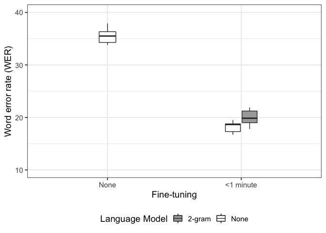

SLI-ASR Evaluations
================
Nay San
23 April, 2022

``` r
library(tidyverse)
library(coxed)

# Functions to get bootstrapped confidence intervals
conf_l <- function(x) { bca(x)[1] }
conf_u <- function(x) { bca(x)[2] }

sli_results <- read_csv("kshot-f1s.csv") %>%
    mutate(
    k = ifelse(k == -1, "All", as.character(k)),
    k = factor(k, levels = c("1", "5", "10", "25", "50", "All"))
  )

asr_results <- read_csv("asr_wer-cer.csv")
```

## SLI

### Mean F1

``` r
f1_stats <- sli_results %>% 
  group_by(k) %>% 
  summarise(
    mean_f1 = mean(f1),
    conf_l  = conf_l(f1),
    conf_u  = conf_u(f1)
  )

f1_stats %>% 
  ggplot(
    aes(x = k, y = mean_f1)
  ) +
    geom_errorbar(aes(ymin = conf_l, ymax = conf_u), width=0.25, position=position_dodge(width=0.35)) +
    scale_y_continuous(limits = c(0, 1), n.breaks = 5) +
    theme_bw(base_size = 13) +
    ylab("F1 (95% CI)") +
    xlab("Number of training utterances per language") +
    theme(
      legend.position="top",
      panel.grid.major = element_line(colour = "#DCDCDC")
    )
```

<!-- -->

``` r
knitr::kable(f1_stats)
```

| k   |  mean\_f1 |   conf\_l | conf\_u |
|:----|----------:|----------:|--------:|
| 1   | 0.6619432 | 0.2019026 |   0.823 |
| 5   | 0.8383456 | 0.6850000 |   0.885 |
| 10  | 0.8681286 | 0.7990000 |   0.905 |
| 25  | 0.8910826 | 0.8510000 |   0.919 |
| 50  | 0.9025296 | 0.8690000 |   0.925 |
| All | 0.9387494 | 0.9210000 |   0.953 |

### Mean differnce in F1

``` r
sli_results %>%
    spread(key=k, value=f1) %>% 
    mutate(
        All_v_01 = All - `1`,
        All_v_05 = All - `5`,
        All_v_10 = All - `10`,
        All_v_25 = All - `25`,
        All_v_50 = All - `50`
    ) %>%
    select(contains("All_")) %>%
    gather(key = "comparison", value = "f1_diff") %>%
    group_by(comparison) %>%
    summarise(
        mean_diff  = mean(f1_diff),
        conf_l     = conf_l(f1_diff),
        conf_u     = conf_u(f1_diff)
    ) %>%
    mutate(
        conf_width = conf_u - conf_l
    ) %>%
  knitr::kable()
```

| comparison | mean\_diff |   conf\_l |   conf\_u | conf\_width |
|:-----------|-----------:|----------:|----------:|------------:|
| All\_v\_01 |  0.2768062 | 0.1134074 | 0.7360000 |   0.6225926 |
| All\_v\_05 |  0.1004038 | 0.0530000 | 0.2543578 |   0.2013578 |
| All\_v\_10 |  0.0706208 | 0.0330000 | 0.1430000 |   0.1100000 |
| All\_v\_25 |  0.0476668 | 0.0180000 | 0.0900000 |   0.0720000 |
| All\_v\_50 |  0.0362198 | 0.0110000 | 0.0700000 |   0.0590000 |

## ASR

### Training set size

``` r
asr_results %>%
  # Keep same test set, use different-sized subsets of training set
  filter(testset == "test.tsv") %>%
  knitr::kable()
```

| model                              | model\_lm | testset  |   wer |   cer |
|:-----------------------------------|:----------|:---------|------:|------:|
| train-100                          | FALSE     | test.tsv | 0.101 | 0.042 |
| train-80                           | FALSE     | test.tsv | 0.101 | 0.044 |
| train-60                           | FALSE     | test.tsv | 0.118 | 0.052 |
| train-40                           | FALSE     | test.tsv | 0.123 | 0.055 |
| train-20                           | FALSE     | test.tsv | 0.132 | 0.061 |
| train-10                           | FALSE     | test.tsv | 0.134 | 0.061 |
| train-05                           | FALSE     | test.tsv | 0.151 | 0.067 |
| train-01                           | FALSE     | test.tsv | 0.191 | 0.088 |
| wav2vec2-large-robust-ft-swbd-300h | FALSE     | test.tsv | 0.363 | 0.215 |

### Cross-validation experiments

``` r
asr_wers <- asr_results %>%
  # Using new train-test splits
  filter(testset != "test.tsv") %>%
  mutate(
    wer = wer * 100,
    is_baseline = model == "wav2vec2-large-robust-ft-swbd-300h",
    
    `Fine-tuning` = ifelse(model == "wav2vec2-large-robust-ft-swbd-300h", "None", "<1 minute"),
    `Fine-tuning` = factor(`Fine-tuning`, levels = c("None", "<1 minute")),
    `Language Model` = ifelse(model_lm, "2-gram", "None"),
    `Language Model` = factor(`Language Model`, levels = c("None", "2-gram"))
  ) 

asr_wers %>%
  mutate(text = "") %>% 
  ggplot(aes(x = `Fine-tuning`, y=wer, group=`Language Model`)) +
  geom_text(aes(label=text)) +
  geom_boxplot(
    data = filter(asr_wers, is_baseline),
    aes(fill=`Language Model`), width=0.125) +
  geom_boxplot(
    data = filter(asr_wers, !is_baseline),
    aes(fill=`Language Model`), width=0.25) +
  theme_bw(base_size = 14) +
  theme(legend.position="bottom") +
  ylab("Word error rate (WER)") +
  scale_fill_manual(values=c("#A9A9A9", "#FFFFFF")) +
  scale_y_continuous(limits = c(10,40))
```

<!-- -->
